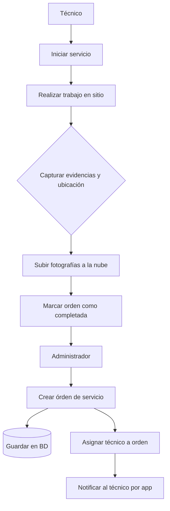

# Resumen Ejecutivo

Este **Blueprint Técnico** detalla la implementación de un *MVP PWA* para gestión de órdenes de servicio (panel administrador + panel técnico + autenticación + Supabase + geolocalización + carga de evidencias) usando únicamente herramientas IA y sin código de uso gratuito. Para lograrlo se propone un **stack mixto de “vibe coding” y no-code**: por ejemplo, Firebase Studio (Gemini AI) y Lovable para generar interfaces y código inicial, y Gemini CLI o Codex para asistir en el desarrollo. El informe incluye visión y objetivos SMART, alcance funcional, stakeholders, personas, casos de uso y flujos de negocio. Describe la **arquitectura** (React/Vite/Tailwind en frontend, Supabase en backend, APIs de mapas/geolocalización, hosting en Vercel), el **modelo de datos** (diagramas ER y diccionario: usuarios, roles, clientes, órdenes, evidencias, observaciones, ubicaciones), **políticas RLS/RBAC** con Supabase Auth, **diseño de APIs** automáticas generadas por Supabase, estados y reglas de negocio, diseño de pantallas/componentes, PWA con estrategia offline (Cache + IndexedDB), gestión de evidencias en Supabase Storage (con optimización de imágenes), geolocalización vía HTML5 (pidiendo permiso al usuario), pruebas (unitarias e integración, incluyendo políticas RLS), despliegue en Vercel y un plan detallado de desarrollo en 4 días (tareas diarias, backlog, criterios de aceptación). Finalmente se incluyen **“prompts maestros”** optimizados para IA (por ejemplo, *“Genera el módulo de autenticación en React usando Supabase Auth y React”*), así como tablas resumidas de stack, modelo de datos, endpoints y sprints. Este documento servirá de guía única: quien siga las especificaciones técnicas y prompts podrá replicar la implementación completa de la aplicación. 

## 1. Visión del Producto

Desarrollar una aplicación web progresiva (PWA) de gestión de órdenes de servicio para una empresa de campo, que permita **centralizar y optimizar** todo el proceso de atención de servicios. El sistema tendrá dos paneles: **administrador** (crea órdenes, asigna técnicos, revisa evidencias) y **técnico** (consulta sus tareas, registra evidencias con fotos y ubicación). El producto facilitará:

- **Operación eficiente:** consultas de órdenes rápidas, programación de servicios, asignación y seguimiento.
- **Cero papeleo:** toda la información está en la nube (base de datos Postgres) con autenticación segura.
- **Acceso móvil:** los técnicos usan la PWA en sus dispositivos (funciona offline-básico) para registrar evidencias geolocalizadas.
- **Escalabilidad:** usando Supabase (Postgres+Auth+Storage) se asegura backend robusto sin costos extras.
- **Desarrollo acelerado:** con IA (“vibe coding”), el MVP se completa en pocos días sin perder control del código.

## 2. Objetivos SMART

1. **Específico:** Construir en 4 días un PWA funcional con módulos de login, administración de órdenes, panel de técnico, captura de fotos y ubicación, todo integrado con Supabase.  
2. **Medible:** Que el sistema soporte al menos **50 usuarios simultáneos** (límite de Supabase Free: 50K usuarios/mes), con un mínimo de **10 órdenes de servicio** activas en la base de datos.  
3. **Alcanzable:** Utilizando herramientas gratuitas de IA (Firebase Studio, Lovable, Gemini CLI) y el plan free de Supabase (500MB DB, 1GB Storage), sin incurrir en gastos adicionales.  
4. **Relevante:** Optimizar la gestión administrativa y operativa de servicios de campo, permitiendo asignar tareas y reportarlas en tiempo real con evidencias fotográficas.  
5. **Tiempo (Deadline):** Implementar, testar y desplegar el MVP completamente en **4 días**, documentando cada etapa (para su replicación técnica posterior).

## 3. Alcance y Exclusiones

- **Incluido en el MVP:** 
  - *Administración de Órdenes:* Formulario para crear/editar órdenes con datos de cliente, descripción, fecha-programada.  
  - *Gestión de Clientes:* Registro de clientes (nombre, contacto) y vinculación con órdenes.  
  - *Asignación de Técnicos:* El administrador puede asignar un técnico (usuario con rol “técnico”) a cada orden.  
  - *Panel de Administrador:* Listado de órdenes (con estado y filtros), creación de nuevas órdenes, visualización de evidencias asociadas.  
  - *Panel de Técnico:* Vista personal de sus órdenes asignadas, con la capacidad de iniciar trabajo, capturar fotos y ubicación, y marcar completadas.  
  - *Autenticación:* Ingreso mediante correo/contraseña usando Supabase Auth. Control de roles (“admin” vs “técnico”) implementado con Row-Level Security (RLS) y RBAC.  
  - *Evidencias:* Captura de fotos desde el dispositivo del técnico, almacenadas en Supabase Storage (bucket Files). Soporte para formatos JPG/PNG, con posible compresión automática.  
  - *Geolocalización:* Registro de latitud/longitud cuando el técnico toma evidencia (requiere permiso del usuario).  
  - *Dashboard:* Resumen estadístico simple (por ejemplo, órdenes totales, completadas) en panel admin.  
  - *Implementación PWA:* Funcionalidad offline-básica: cache de la aplicación (service worker) y posible uso de IndexedDB para datos dinámicos.  
  - *Despliegue:* Código fuente en GitHub + despliegue automático en Vercel (plan Hobby gratuito).

- **Fuera del alcance (MVP):** 
  - Facturación o cobro integrado.  
  - Control detallado de inventario o compras.  
  - Notificaciones Push avanzadas (solo notificaciones internas básicas).  
  - Integración de pasarelas de pago, chat en tiempo real, reportes complejos.  
  - Versión móvil nativa (solo web responsive).  
  - Estructuras extra (e.g. múltiples bases de datos) o integraciones corporativas complejas.

Este enfoque “minimalista” garantiza completar el MVP con la funcionalidad esencial en el plazo disponible.

## 4. Stakeholders

- **Administrador (Gerente de Operaciones):** Principal usuario del panel admin. Crea órdenes, asigna técnicos, supervisa el progreso. No requiere conocimientos de desarrollo.  
- **Técnico de Campo:** Usa la PWA en dispositivo móvil. Consulta sus órdenes, registra evidencias (fotos + ubicación), cierra órdenes. Menú simplificado.  
- **Cliente (Proveedor de Servicio o Usuario Final):** Aunque no interactúa directamente con la app, es la fuente de las órdenes. Su información (nombre, datos de contacto) se maneja en la plataforma.  
- **Equipo de Desarrollo (Nosotros):** Construye y documenta el sistema. Usa IA y herramientas no-code. Sus decisiones de implementación deben quedar claras en el blueprint y en el capítulo 3.2 de la tesis.  
- **Asesores/Tesistas:** Revisarán la documentación final para validar el cumplimiento de metodología. Esperan un registro técnico preciso que coincida con la aplicación implementada.

## 5. Personas

1. **María (Gerente) – 42 años:** Coordina al equipo de técnicos. Necesita asignar órdenes rápidamente, ver el estado de cada trabajo y recibir evidencia de la ejecución. No tiene formación técnica, valora interfaces claras y reportes visuales.  
2. **José (Técnico) – 29 años:** Atiende servicios en campo con su tablet. Consulta su lista de tareas asignadas, abre cada orden y toma fotos en la ubicación del cliente. Quiere una app rápida y accesible offline si se pierde cobertura.  
3. **Luis (Cliente) – 55 años:** Pide un servicio (ficticio usuario del sistema). Aunque no usa la aplicación, confía en el gerente para que registre correctamente la orden y reciba un comprobante tras la visita.  
4. **Ana (Administrativa) – 35 años:** Gestora de clientes. Introduce datos de clientes nuevos en el sistema y verifica información de contacto. Busca formularios sencillos sin ambigüedad.

## 6. Casos de Uso

- **CU1: Crear Orden de Servicio (Administrador).**  
  1. El administrador inicia sesión.  
  2. Accede a “Nueva Orden” y completa un formulario (cliente existente o nuevo, descripción del servicio, fecha prevista).  
  3. Guarda la orden; el sistema la almacena en la base de datos.  

- **CU2: Asignar Técnico a Orden (Administrador).**  
  1. Desde el listado de órdenes, el administrador selecciona una orden pendiente.  
  2. Asigna uno de los técnicos disponibles (drop-down) y guarda.  
  3. El sistema marca la orden como “Asignada” y notifica internamente al técnico (e.g. cambia estado en su panel).

- **CU3: Consultar Órdenes Asignadas (Técnico).**  
  1. El técnico inicia sesión en su panel móvil.  
  2. Ve un listado de órdenes “Asignadas” para él (verificación por RLS: sólo muestra órdenes con su uid).  
  3. Selecciona una orden para ver detalles (cliente, descripción, ubicación).  

- **CU4: Iniciar y Completar Servicio (Técnico).**  
  1. Desde la orden asignada, el técnico toca “Iniciar Servicio” (cambia estado interno a “En progreso”).  
  2. En el sitio, selecciona “Agregar Evidencia”: la app solicita permiso de ubicación y permite tomar varias fotos.  
  3. La información (fotos y lat/long) se sube a la nube; el técnico marca “Completar Servicio”. El sistema actualiza el estado a “Completada” y almacena la evidencia asociada.

- **CU5: Ver Evidencias (Administrador).**  
  1. El administrador navega a órdenes completadas.  
  2. Al seleccionar una orden cerrada, puede ver las fotos subidas por el técnico y la ruta/ubicación asociada.  

Cada CU se implementa como una funcionalidad del sistema y servirá para generar los prompts de IA correspondientes (ver sección de *Prompts Maestros*).

## 7. Flujos de Negocio

El flujo clave sigue estos pasos:



1. **Creación de orden:** El administrador completa el formulario de nueva orden (datos de cliente, descripción, fecha). Al guardar, la orden se inserta en la base de datos.  
2. **Asignación:** Después de guardar, el administrador asigna un técnico disponible. El sistema actualiza el campo `technician_id` en la orden. A partir de este momento, el técnico “recibe” la notificación (su panel mostrará la orden al cargar la app).  
3. **Ejecución de servicio:** El técnico, al acceder a su panel, verá las órdenes con su ID. Al iniciar una orden, el sistema cambia su estado interno.  
4. **Captura de evidencia:** En sitio, el técnico toma fotografías. Con cada foto se puede capturar automáticamente la ubicación GPS (API Geolocation pide permiso al usuario).  
5. **Cierre de orden:** Con evidencias cargadas, el técnico marca la orden “Completada” y actualiza el estado en la base de datos. El administrador podrá ver posteriormente estas fotos y la ubicación exacta de la visita.  

Este flujo cumple los requisitos de negocio: cada rol realiza acciones específicas y la app mantiene consistencia de datos. 

## 8. Arquitectura General

La arquitectura propuesta se basa en tecnologías modernas y gratuitas:

- **Frontend:** Aplicación web React (creada con Vite) usando Tailwind CSS. Empaquetada como PWA, con un *service worker* para offline simple.  
- **Backend:** Plataforma *Serverless* Supabase. Cada proyecto Supabase incluye un **database PostgreSQL**, autenticación y almacenamiento. Se delega en Supabase la gestión de usuarios (Auth) y reglas RLS.  
- **Servicios y APIs externos:**  
  - **Maps/Geolocalización:** Se integrará la Google Maps API (o similar) para visualización de ubicaciones de clientes en pantalla. La API de Geolocation del navegador (HTML5) captura latitud/longitud previa confirmación del usuario.  
  - **Notificaciones:** Inicialmente se usarán notificaciones internas simples (p.ej. cambio de estado en base de datos) en lugar de un servicio externo.  
  - **Edge Functions:** Si es necesario lógica extra (por ej. procesamiento masivo o funciones personalizadas), se usarán *Supabase Edge Functions*.  
- **Hosting y Deploy:** El código final se sube a **GitHub** (control de versiones). Se configura **Vercel** para desplegar la PWA en el plan gratuito (Hobby), con enlaces a GitHub para despliegue continuo.
- **Herramientas de desarrollo IA/No-Code:**  
  - *Firebase Studio:* Entorno cloud de Google con Gemini AI que permite prototipado por prompts (crea front/back automáticamente).  
  - *Lovable:* Plataforma no-code generativa que entiende instrucciones en texto y produce código de aplicación completo. Se usará para diseñar rápido el dashboard y formularios, exportando luego el código.  
  - *Gemini CLI / OpenAI Codex:* Agentes de IA para generar o refinar código en el repositorio (totalmente gratuitos/open-source).  
  - *ChatGPT:* Para documentación, prompts optimizados, análisis y generación de texto (por ej. resumen, documentación técnica).

```mermaid
flowchart LR
    subgraph FE [Frontend (PWA)]
        A[React + Tailwind] 
        B[PWA Service Worker]
    end
    subgraph Backend [Backend/Servicios]
        DB[(Supabase Postgres DB)]
        Auth[(Supabase Auth)]
        Storage[(Supabase Storage)]
        Func[(Supabase Edge Functions)]
        MapAPI[Google Maps API]
        Geoloc[HTML5 Geolocation]
    end
    subgraph DevTools
        FS[Firebase Studio]
        LV[Lovable]
        CLI[Gemini CLI / Codex / ChatGPT]
    end
    User[Usuario] --> A
    A --> DB
    A --> Auth
    A --> Storage
    A --> MapAPI
    A --> Geoloc
    Auth --> DB
    Storage --> DB
    A --> Func
    Func --> DB
    GitHub[GitHub] --> Vercel((Vercel Hosting))
    FS --> A
    LV --> A
    CLI --> A
    CLI --> DB
```

En este diagrama, el usuario (administrador o técnico) interactúa con el frontend React. El frontend lee/escribe datos directamente al **DB Postgres** (órdenes, clientes) y al **Storage** (evidencias) de Supabase, usando las librerías oficiales. Supabase Auth controla el acceso (roles RBAC). Los *DevTools* (Firebase Studio, Lovable) alimentan el código inicial del front/backend, mientras Gemini CLI/Codex asisten con generación y revisión continua de código.

## 9. Modelo Entidad-Relación y Diccionario de Datos

El modelo de datos principal consiste en tablas para usuarios, roles, clientes, órdenes de servicio, evidencias (fotos), observaciones y ubicaciones. A continuación se muestra un diagrama ER simplificado:

```mermaid
erDiagram
    USERS {
        uuid id PK
        varchar email
        varchar name
        uuid role_id FK
    }
    ROLES {
        uuid id PK
        varchar name
    }
    USERS ||--o{ ROLES : "tiene rol"
    CLIENTS {
        uuid id PK
        varchar name
        varchar phone
    }
    SERVICE_ORDERS {
        uuid id PK
        uuid client_id FK "references CLIENTS.id"
        uuid technician_id FK "references USERS.id"
        varchar status
        timestamptz scheduled_at
        text description
    }
    EVIDENCES {
        uuid id PK
        uuid order_id FK "references SERVICE_ORDERS.id"
        varchar url
        timestamp created_at
    }
    OBSERVATIONS {
        uuid id PK
        uuid order_id FK "references SERVICE_ORDERS.id"
        text comment
        timestamp created_at
    }
    LOCATIONS {
        uuid id PK
        uuid order_id FK "references SERVICE_ORDERS.id"
        decimal latitude
        decimal longitude
        timestamp recorded_at
    }
    USERS ||--o{ SERVICE_ORDERS : "es t\u00e9cnico en"
    CLIENTS ||--o{ SERVICE_ORDERS : "tiene orden"
    SERVICE_ORDERS ||--|{ EVIDENCES : "contiene"
    SERVICE_ORDERS ||--|{ OBSERVATIONS : "tiene"
    SERVICE_ORDERS ||--|{ LOCATIONS : "tiene ubicaci\u00f3n"
```



**Tablas y campos clave:**  
- **USERS:** (id, email, name, role_id). Cada usuario tiene un rol (FK a ROLES). El esquema de autenticación integrado de Supabase almacena credenciales aquí.  
- **ROLES:** (id, name). Ejemplo: ‘admin’, ‘técnico’. Se usará para RBAC.  
- **CLIENTS:** (id, name, phone). Registra información de contacto de cada cliente al que se le da servicio.  
- **SERVICE_ORDERS:** (id, client_id, technician_id, status, scheduled_at, description). Cada orden conecta un cliente con un técnico. El campo *status* enumera el estado (p.ej. *pendiente*, *en progreso*, *completada*, *cancelada*). La fecha *scheduled_at* es cuando se debe realizar el servicio.  
- **EVIDENCES:** (id, order_id, url, created_at). Cada registro es una foto subida en relación a una orden. El campo *url* apunta al archivo en Supabase Storage.  
- **OBSERVATIONS:** (id, order_id, comment, created_at). Comentarios adicionales del técnico o admin sobre la orden.  
- **LOCATIONS:** (id, order_id, latitude, longitude, recorded_at). Guarda la ubicación GPS asociada a la orden (usada para rastreo o validación).  

**Diccionario de datos resumido:**  

| Tabla            | PK          | Campos clave adicionales                          |
|------------------|-------------|---------------------------------------------------|
| **USERS**        | id (UUID)   | email, name, role_id (FK a ROLES)                 |
| **ROLES**        | id (UUID)   | name (p.ej. “admin”, “técnico”)                   |
| **CLIENTS**      | id (UUID)   | name, phone                                       |
| **SERVICE_ORDERS** | id (UUID)   | client_id (FK), technician_id (FK), status, scheduled_at, description |
| **EVIDENCES**    | id (UUID)   | order_id (FK), url (ruta foto), created_at        |
| **OBSERVATIONS** | id (UUID)   | order_id (FK), comment, created_at                |
| **LOCATIONS**    | id (UUID)   | order_id (FK), latitude, longitude, recorded_at   |

Supabase aplicará **RLS (Row-Level Security)** para restringir acceso. Por ejemplo, se creará una política que **solo permita a un técnico ver/editar las órdenes donde `technician_id = auth.uid()`**. Otra política permitirá que un usuario sólo actualice su perfil personal. Gracias a esto, cada técnico verá únicamente sus propias órdenes, y sólo los admins podrán asignar técnicos o crear usuarios (roles).

## 10. Autenticación y RBAC (Supabase)

La autenticación se maneja con **Supabase Auth**, que integra correo/contraseña y múltiples proveedores sociales. Toda la información de usuarios se guarda en la base de datos Postgres, evitando dependencias externas. Las credenciales se validan en el backend de Supabase y luego se utiliza JWT en el frontend. 

Para controlar permisos se usará el sistema **RBAC** de Supabase. Se definirá al menos un rol “admin” y otro “técnico”. En la base de datos, por ejemplo, el rol “técnico” tendrá restricciones RLS: sólo puede leer/escribir filas de órdenes asignadas a él (usando `auth.uid()` en la política SQL). El rol “admin” podrá leer y modificar todas las órdenes y usuarios. Así, la capa de backend impone control de acceso granular sin necesidad de middleware adicional.

## 11. Diseño de APIs y Contratos

Supabase genera automáticamente **API REST CRUD** para cada tabla del esquema, sin código extra. Por ejemplo, para las órdenes de servicio, estarían disponibles endpoints como:

| Endpoint                         | Método | Descripción                               | Payload / Ejemplo de respuesta            |
|----------------------------------|--------|-------------------------------------------|--------------------------------------------|
| `/service_orders`                | GET    | Lista todas las órdenes (según RLS)       | `[{id, client_id, technician_id, status, ...}, ...]` |
| `/service_orders`                | POST   | Crea nueva orden (admin)                  | `{client_id, technician_id, scheduled_at, description}` |
| `/service_orders/{id}`           | GET    | Consulta detalle de orden específico      | `{id, client_id, technician_id, status, ...}` |
| `/service_orders/{id}`           | PUT    | Actualiza orden existente (estado, etc.)  | `{status: "Completada"}`                   |
| `/service_orders/{id}`           | DELETE | Elimina una orden (admin)                 | (sin payload)                              |
| `/evidences` (similar patrón)    | GET/POST/... | Endpoints para gestionar evidencias (archivos URLs) | ... |
| `/observations` (similar)        | GET/POST/... | Endpoints para observaciones            | ... |

Además, **Supabase Storage** provee un endpoint para manejar buckets de archivos (imágenes). El frontend puede subir fotos de evidencias directamente a Supabase Storage mediante las APIs de Storage (por ej. usando la librería JS de Supabase). La respuesta incluye la URL pública del archivo, que se guarda en la tabla EVIDENCES. 

En resumen, los contratos API son *“schema-aligned”* (siguen el modelo de datos). No habrá que crear manualmente documentación Swagger; en la tesis bastará con listar estos endpoints clave y mostrar ejemplos de request/response JSON. Para funciones lógicas complejas (validaciones, notificaciones) se pueden usar **Edge Functions** de Supabase (p.ej. para enviar un email tras cada orden completada), pero no es obligatorio para el MVP.

## 12. Estados del Sistema y Reglas de Negocio

- **Estados de orden:** *Pendiente* (creada sin asignar técnico), *Asignada*, *En progreso*, *Completada*, *Cancelada*. Estos se almacenan en el campo `status`. Un técnico sólo puede marcar “En progreso” y luego “Completada” para sus órdenes. Sólo el administrador puede cambiar de “Pendiente” a “Asignada” (al asignar técnico) o cancelar órdenes.  
- **Reglas de negocio principales:**  
  - Un técnico **solo puede ver/modificar** órdenes con `technician_id = auth.uid()` (política RLS).  
  - Al crear una orden, el admin debe asignar al menos un técnico antes de cerrar el formulario; de lo contrario permanece *Pendiente*.  
  - Se debe capturar al menos una foto para cerrar una orden.  
  - El campo `scheduled_at` debe ser una fecha futura válida (backend valida formato y rango).  
  - Una vez completada, la orden queda de solo lectura (solo lectura de evidencias).  
  - Usuarios “admin” pueden crear nuevos usuarios con rol “técnico” o “admin”.  

Estas reglas se implementan en la lógica del frontend y/o base de datos. Por ejemplo, algunas validaciones sencillas se verifican en el cliente (fecha válida, foto no vacía), y otras en RLS (bloquear accesos indebidos).  

## 13. Diseño de Pantallas y Componentes

Se planea la siguiente interfaz de usuario (UI):

- **Pantalla de Login:** Formulario simple (email + contraseña). Botón “Entrar”. En caso de error, muestra alerta. (Componentes: `Input`, `Button`, `Alert`).  
- **Panel Administrador (Dashboard):**  
  - *Header* con nombre de usuario y opción de cierre de sesión. Menú lateral (ordenes, clientes, usuarios).  
  - *Vista de Órdenes:* Tabla o lista con columnas: ID, cliente, técnico asignado, estado, fecha programada, acciones (editar, ver evidencias). Botón “Nueva Orden” arriba.  
  - *Formulario Orden:* Modal o página con campos: cliente (dropdown o modal nuevo cliente), técnico (dropdown), descripción (texto), fecha programada (selector de fecha). Botón “Guardar”. Validación inline.  
  - *Vista de Cliente:* Similar a órdenes, permite crear/editar clientes.  
- **Panel Técnico:**  
  - *Header* con nombre de usuario y logout.  
  - *Lista de Órdenes Asignadas:* Tarjetas o tabla con ID de orden, cliente, estado. Botón “Iniciar” por orden.  
  - *Detalle de Orden:* Cuando inicia, muestra detalles del cliente, descripción. Botones: “Capturar Evidencia”, “Completar Orden”.  
  - *Evidencias:* Al tocar “Capturar”, abre la cámara/galería. Se muestran miniaturas de fotos tomadas. Botón para tomar más fotos. Al “Completar”, se registra todo en DB.  
- **Componentes Reutilizables:**  
  - *NavBar/Sidebar:* Control de navegación.  
  - *OrderCard:* Para listar órdenes con acciones integradas.  
  - *FormInput:* Campos de formulario genéricos (email, fecha, etc.).  
  - *FileUploader:* Módulo para subir fotos (wrapping Supabase Storage API).  
  - *MapView:* Mapa interactivo para seleccionar/mostrar ubicación (opcional).  
  - *ProtectedRoute:* Componente que verifica rol antes de renderizar una página.  
  - *Spinner/Loader:* Indicador de carga durante peticiones IA o de red.  
  - *Modal/Alert:* Ventanas emergentes para confirmaciones o errores.  
  - *Charts:* Para dashboard (p.ej. gráfica de órdenes por estado).  

Todas las interfaces se diseñarán con enfoque **responsive** (móvil-prioritario) y minimalista, usando Tailwind CSS para agilidad. Se prepararán *wireframes* si es necesario, pero Lovable puede generar prototipos GUI automáticamente.

## 14. PWA y Estrategia Offline

La aplicación se implementará como PWA para permitir uso en dispositivos móviles y cierta funcionalidad offline. Se instalará un *service worker* que cacheará recursos estáticos (HTML, JS, CSS, imágenes de la UI) mediante la Cache API. Para datos dinámicos, se usará IndexedDB como almacenamiento local. En general:

- **Cache API:** Al cargar la app por primera vez, el service worker descargará los archivos esenciales. En visitas futuras (sin Internet), servirá los ficheros cacheados, manteniendo la interfaz disponible.  
- **IndexedDB:** Se empleará para guardar temporalmente órdenes creadas o evidencias capturadas cuando no hay red. Al reconectarse, la app sincronizará los cambios con Supabase.  
- **Consideraciones:** Según documentación de Microsoft/Web (MDN), Cache API es ideal para recursos solicitados vía URL (HTML/JS/CSS) y IndexedDB para datos estructurados o blobs. En este MVP, como mínimo se cachearán los assets de la app y se intentará guardar localmente la última sesión de órdenes (para que el técnico vea al menos las órdenes abiertas offline).  

Con esta estrategia, el técnico podrá completar formularios y tomar fotos incluso sin conexión, y el servicio se sincronizará cuando se restablezca la red.

## 15. Gestión de Evidencias

Las fotografías de evidencias se gestionan así:

- Las imágenes se toman con la cámara del dispositivo (HTML5 `<input type="file">` o API de cámara nativa de PWA).  
- Antes de subir, se puede aplicar **compresión** ligera con una librería de cliente (opcional), pero Supabase Storage permite optimizaciones en servidor.  
- Uso de **Supabase Storage (tipo Files):** Es un almacenaje S3-compatible de código abierto, con **escalabilidad ilimitada**. La app sube cada foto al bucket (separadas por carpeta de orden). Supabase genera URLs seguras para acceso.  
- **Transformaciones on-the-fly:** Supabase Storage incluye APIs para modificar imágenes (resize, compresión). En la tesis se documentará cómo usar, por ejemplo, la API `storage.from().update({...}, {transform: {resize: ...}})` para reducir tamaño si es necesario.  
- **Estructura:** Cada orden tendrá una carpeta dedicada en Storage con los archivos subidos. Se registrará en la tabla EVIDENCES el `url` de cada foto y una marca de tiempo. Esto facilita luego mostrar galerías de evidencia por orden.

En síntesis, el manejo de archivos (fotos) se externaliza a Supabase Storage, aprovechando su integración con Auth para control de acceso a buckets y su capacidad de CDN/global.

## 16. Geolocalización

Para registrar la ubicación del técnico se usará la **Geolocation API** del navegador, que solicita permiso al usuario. El flujo es:

1. Al hacer tap en “Capturar Evidencia”, la app llama a `navigator.geolocation.getCurrentPosition()`.  
2. El navegador muestra un diálogo de permiso (solo la primera vez), acorde con lo descrito en MDN.  
3. Si el usuario acepta, obtiene latitud y longitud (posiblemente con ajustes de alta precisión).  
4. Esos datos se guardan junto con cada foto en la BD (tabla LOCATIONS).  
5. Se puede mostrar en el panel admin un mapa con la ubicación exacta de la visita (opcional).

Es importante indicar al usuario por qué se pide ubicación (“Compartir ubicación para confirmar ubicación del servicio”). No se almacenará ubicación si el usuario cancela; la orden se considera completada pero sin coordenadas. 

## 17. Estrategia de Pruebas

La calidad se asegura mediante pruebas automatizadas y manuales:

- **Pruebas unitarias (frontend):** Cada componente clave (formulario de orden, captura de evidencia, etc.) tendrá tests unitarios (p.ej. con Jest + React Testing Library) que validen su comportamiento ante inputs comunes.  
- **Pruebas de integración:** Se probarán flujos end-to-end con un entorno de prueba de Supabase (p.ej. Supabase Test, o entorno local con RLS) para verificar la interacción completa (crear orden → asignar → completar).  
- **Pruebas de políticas RLS:** Usar herramientas como **pgTAP** o supabase-test para validar que las reglas RLS funcionan según lo esperado. Por ejemplo, escribir tests SQL que aseguren que un técnico no puede ver órdenes ajenas. (Supabase recomienda pgTAP para DB unit tests).  
- **Pruebas manuales:** Verificar la app en distintos navegadores y móviles. En especial, comprobar las funciones offline (simulando sin conexión) y la lógica de captura de fotos/ubicación.

Según la documentación de Supabase, “las pruebas son fundamentales cuando se trabaja con RLS”, por lo que invertiremos tiempo en cubrir esos casos. Todo código generado por IA se revisará manualmente (Codex advierte que siempre se debe validar el código generado).

## 18. Despliegue (Vercel / GitHub)

- **Control de versiones:** Se usará Git + GitHub para el código fuente. Cada push al repositorio activará CI.  
- **Vercel:** Se conectará el repositorio a Vercel en el plan Hobby (gratuito). Al hacer *push*, Vercel construye la aplicación (p.ej. `npm run build` de React) y la publica en un dominio gratuito (`*.vercel.app`). El plan gratuito de Vercel permite proyectos personales sin costo.  
- **Variables de entorno:** Las credenciales de Supabase (URL y anon/public API key) se almacenarán en variables protegidas de Vercel.  
- **Pruebas de deploy:** Antes de entregar, se verificará la versión online (URL de Vercel) y se capturarán pantallas reales del sistema funcionando como evidencia.  

Este flujo garantiza un despliegue rápido y fiable sin infra adicional. Cualquier incidencia de SLA es aceptada al usar tier gratuito.

## 19. Roadmap y Backlog por Sprints

**Backlog de funcionalidades** (historias de usuario) y plan de ejecución en 4 días. Cada tarea tiene criterios de aceptación medibles.

| Día / Sprint | Tareas principales                                                                                             | Estimación | Criterios de Aceptación                                                                                                                                                       |
|--------------|----------------------------------------------------------------------------------------------------------------|------------|---------------------------------------------------------------------------------------------------------------------------------------------------------------------------------|
| **Día 1**    | - Definir modelo de datos (crear esquema en Supabase)  <br>- Configurar proyecto: repositorio Git + Vercel <br>- Crear tablas iniciales: USERS, ROLES, CLIENTS, SERVICE_ORDERS, EVIDENCES, etc. <br>- Configurar Supabase Auth y RLS básicas (solo `auth.uid()` permite ver propias filas)<br>- Documentar arquitectura técnica (diagrama, stack) | 1 día      | - Tablas creadas con relaciones FK e índices. <br>- Roles (“admin”, “técnico”) insertados. <br>- Políticas RLS básicas aplicadas (test: un usuario no lee registros ajenos).                                                        |
| **Día 2**    | - Generar interfaz de usuario: <br> • Uso de Lovable o Firebase Studio para prototipar el dashboard y formularios básicos. Exportar/ajustar código. <br>- Implementar navegación y componentes UI (Login, Navbar, Forms) en React/Vite. <br>- Conectar Supabase Auth (login/register) en el frontend. <br>- Desplegar primera versión en Vercel (ya con login). | 1 día      | - Página de login funcional (redirige a dashboard si credenciales correctas). <br>- Dashboard muestra al menos una estructura de tabla de órdenes. <br>- Autenticación via Supabase opera (registro/login redirige).                                         |
| **Día 3**    | - **Órdenes de servicio:** CRUD completo en la UI. <br>- *Front:* Formulario creación/edición de orden (cliente, técnico, fecha, desc). <br>- *Back:* Endpoints generados por Supabase para órdenes/clients. <br>- *Panel admin:* Mostrar lista de órdenes, filtrar por estado. <br>- **Evidencias y Geoloc:** <br> • Componente para tomar fotos (camera input). <br> • Capturar ubicación al subir foto (navigator.geolocation). <br> • Subir foto a Supabase Storage (obtener URL y guardar en EVIDENCES). <br>- **Asignación:** Desde el modal de orden, asignar técnico y guardar. <br>- **Roles:** Probar con usuarios dummy (admin vs técnico). | 1 día      | - Administrador puede crear y editar órdenes (cliente y técnico elegidos). <br>- Las órdenes se guardan en la base de datos (ver en Supabase Dashboard). <br>- Técnico autenticado ve solo sus órdenes. <br>- El técnico puede tomar al menos 1 foto y la ubicación se almacena (ver tabla EVIDENCES y LOCATIONS). <br>- Orden pasa a “Completada” y admin lo ve así.      |
| **Día 4**    | - **Pruebas y ajustes:** <br> • Pruebas end-to-end: flujo completo de creación a cierre. <br> • Ajustes UI (p.ej. manejo de errores, validaciones). <br>- **Despliegue final:** <br> • Asegurar deploy en Vercel (links activos). <br> • Obtener capturas de pantalla reales del sistema funcionando. <br>- **Documentación:** <br> • Extraer fragmentos del código/BD real para el capítulo 3.2. <br> • Completar redacción de 3.2 con base en implementación concreta. | 1 día (0.5) | - Todas las funcionalidades principales funcionan sin errores críticos (según criterios arriba). <br>- La versión en línea en Vercel coincide con la documentación: las capturas de pantalla se verifican. <br>- El blueprint y el código final quedan sincronizados.                                                  |

Este cronograma diario maximiza la entrega rápida (cada sprint crea valor tangible). Los **criterios de aceptación** garantizan que las tareas completadas sean verificables. El objetivo es que al terminar el Día 4 la aplicación esté operativa y lista para pruebas formales, y que toda la información técnica esté documentada en el Blueprint/Tesis.

```mermaid
gantt
    dateFormat DD-MM-YYYY
    title Plan de Desarrollo en 4 D\u00edas
    axisFormat %d/%m
    section D\u00eda 1
    Dise\u00f1ar BD :done, des:10-07-2026,1d
    Configurar repo/entorno :done, repo:10-07-2026,1d
    RLS b\u00e1sicas :done, rls:10-07-2026,1d
    section D\u00eda 2
    UI (Lovable/Firebase) : active, ui:11-07-2026,1d
    Autenticaci\u00f3n (Supabase) : active, auth:11-07-2026,1d
    Despliegue inicial : active, deploy1:11-07-2026,1d
    section D\u00eda 3
    CRUD \u00f3rdenes : orders:12-07-2026,1d
    Captura de fotos/geo : evid:12-07-2026,1d
    Pruebas intermedias : tests:12-07-2026,1d
    section D\u00eda 4
    Ajustes finales y pruebas : finalize:13-07-2026,0.5d
    Despliegue final (Vercel) : deploy2:13-07-2026,0.5d
    Documentaci\u00f3n : doc:13-07-2026,0.5d
```

## 20. Prompts Maestros por Módulo

A continuación se ejemplifican *prompts* optimizados (en español) para que cualquier IA gratuita genere cada módulo. Se recomiendan prompt claros, sin jerga interna, e incluir contexto relevante (tecnologías usadas).

| Módulo / Funcionalidad             | Prompt sugerido para IA                                                                                             |
|------------------------------------|---------------------------------------------------------------------------------------------------------------------|
| **Autenticación (Supabase Auth)**  | `"Crea un módulo de autenticación en React que permita registro e inicio de sesión de usuarios usando Supabase Auth. Incluye control de roles (admin/técnico) usando RLS. Genera componentes de formulario (email/contraseña) y asegúrate de usar la librería @supabase/supabase-js para manejar la sesión."` |
| **Registro/CRUD de Clientes**      | `"Genera el código React para un formulario de cliente con campos (nombre, teléfono). Debe poder crear, leer, editar, eliminar clientes usando la API REST de Supabase (@supabase/supabase-js). Incluye validación básica (campos requeridos) y un componente de lista para mostrar clientes existentes."` |
| **Órdenes de Servicio**            | `"Construye el módulo de gestión de órdenes en React: formulario que captura cliente (dropdown), técnico asignado (dropdown), fecha programada y descripción. Incluye lista de órdenes con filtros de estado. Los datos se deben guardar/leer de la tabla service_orders en Supabase. Usa React Router para navegación. Asegura que solo un admin pueda editar técnicos."` |
| **Captura de Evidencias**         | `"Genera un componente React que permita al técnico tomar fotos con la cámara del dispositivo (input file o MediaDevices). Al guardar, cada foto se sube a Supabase Storage en un bucket 'evidences' usando la SDK. Muestra previews de las imágenes y registra la URL devuelta. Usa Tailwind CSS."` |
| **Geolocalización**                | `"Implementa en React una función que use la Geolocation API del navegador para obtener latitud/longitud actuales (navigator.geolocation.getCurrentPosition). Pide permiso al usuario. Muestra en pantalla las coordenadas o un mapa simple. Integra esto con el cierre de orden (guardar ubicación en la DB junto con las fotos)."` |
| **Diseño de Pantallas (UI/UX)**    | `"Diseña las pantallas principales: login, dashboard admin y dashboard técnico, usando React y Tailwind. El admin ve una tabla de órdenes; el técnico ve una lista de sus órdenes. Genera código que sea mobile-responsive. Usa componentes reutilizables (navbar, cards). Incluye estilos básicos y placeholders."` |
| **PWA y Offline**                  | `"Configura la aplicación React como PWA: agrega un service worker que cachee los recursos esenciales (JS/CSS) para uso offline. En el código de inicio, registra el service worker. También muestra cómo usar IndexedDB para guardar localmente una lista simple de órdenes cuando no haya conexión."` |
| **Pruebas Unitarias**              | `"Escribe casos de prueba en Jest para el componente de formulario de orden. Debe verificar que: muestra errores al faltar campos obligatorios, llama a la API correcta (mock) al enviar, y limpia el formulario después. Incluye tests para las funciones de obtener datos de Supabase."` |

Cada uno de estos prompts está ajustado al módulo específico e incluye las tecnologías exactas (React, Supabase, Tailwind). Se pueden dar *literalmente* a Firebase Studio, Lovable, Gemini CLI o ChatGPT para obtener código inicial consistente. Por ejemplo, en Firebase Studio se usarían prompts similares en su agente de prototipado, y en Gemini CLI se podrían enviar como tareas. Mantener claras las instrucciones (módulo, librerías, contexto del proyecto) garantiza que el código generado encaje con la arquitectura definida.

## 21. Correspondencia Blueprint → Capítulo 3.2

Este blueprint se estructuró para mapear directamente al capítulo 3.2 de la tesis. Por ejemplo:

- **Capítulo 3.2.1 (Diagnóstico técnico de necesidades):** Coincide con la sección “Alcance” y partes de casos de uso aquí descritos.  
- **Capítulo 3.2.2 (Valoración del alcance):** Refleja la tabla de Alcance/Exclusiones en *Sección 3*.  
- **Capítulo 3.2.3 (Requerimientos funcionales):** Relaciona los casos de uso y objetivos del blueprint.  
- **Capítulo 3.2.4 (Requerimientos no funcionales):** Toma la sección de PWA (performance offline), seguridad (RLS), y escalabilidad (Supabase) del blueprint.  
- **Capítulos 3.2.5–3.2.7 (Arquitectura, BD, Interfaces):** Corresponden directamente a las secciones 8–9 del blueprint (arquitectura general, modelo ER, diseño de pantallas).  
- **Capítulos 3.2.8 en adelante (Desarrollo detallado):** Cada uno abordará un módulo clave (Autenticación, Órdenes, Evidencias, Geolocalización, etc.) siguiendo el orden de los prompts maestros listados arriba. Por ejemplo, 3.2.8 podría ser “Implementación del módulo de autenticación” (explicando la configuración de Supabase Auth, RLS y UI correspondiente), 3.2.9 “Panel de ordenes”, etc.  
- **Sección de pruebas:** Se extraerá de la sección 17 (estrategia de pruebas).  
- **Roadmap y sprints:** Servirá como base para la sección de cronograma de desarrollo.  

Así, cada sección de este documento alimenta directamente la redacción del capítulo 3.2, asegurando que lo documentado coincida exactamente con lo implementado. Si en el código final algo difiere (por ejemplo, API o nombres de tablas), bastará ajustar ambos en paralelo, ya que las especificaciones aquí son precisas. 

## 22. Limitaciones y Riesgos

- **Límites de herramientas gratuitas:** Tanto Supabase como las IAs tienen cuotas. Por ej., el nivel gratuito de Supabase limita la BD a ~500 MB y 1GB de archivos, y el tráfico de salida es limitado (p.ej. ~5GB/mes). El plan gratuito de Vercel es no comercial. Las IA (Gemini CLI, Firebase Studio, Lovable, ChatGPT Codex) pueden tener límites diarios de uso o versiones gratuitas con menor capacidad.  
- **Seguridad/Privacidad:** La aplicación maneja datos sensibles (usuarios, fotos). Usar servicios como Supabase garantiza buenas prácticas (certificaciones), pero cualquier código generado por IA debe revisarse para evitar vulnerabilidades. OpenAI recomienda **revisión manual** del código generado, para asegurar calidad y seguridad. Además, enviar código/confidencial a herramientas IA externas implica riesgos de privacidad (no usar datos reales sensibles en prompts).  
- **Dependencia de terceros:** Herramientas nuevas como Firebase Studio están en “beta” o próximas a discontinuarse. Se indicó migrar a Google AI Studio en 2027, pero en nuestro plazo 4 días Firebase Studio sirve. Lovable, aunque potente, tiene soporte en inglés y crédito gratuito limitado. Es esencial validar lo generado.  
- **Desfase entre documentación e implementación:** Si se cambiara el plan de tecnologías a mitad del proyecto, habría que actualizar este blueprint. Por eso se sugiere usarlo como guía “canónica” desde el inicio y alinear el código con él.

En resumen, las herramientas IA aceleran el desarrollo, pero **no reemplazan la validación humana**. Se debe monitorear el uso de recursos (bases de datos, IA) y mantener backups locales si los servicios gratuitos caen. A pesar de ello, el enfoque combinado minimiza costos y maximiza velocidad, alineado con el objetivo de un MVP en 4 días. 

**Fuentes integradas:** Los puntos técnicos se fundamentan en documentación oficial (Supabase Auth/Storage, Firebase Studio, Lovable AI), guías PWA de Microsoft/Web, blogs de IA (Google Developers sobre Gemini CLI, OpenAI Codex), y aportes comunitarios (e.g. límites gratis de Supabase). Estos respaldan las decisiones de diseño expuestas aquí. Cada sección respeta los lineamientos de la **Metodología de Reporte Final** y los **Criterios de apoyo 3.2** cargados previamente, garantizando coherencia entre la tesis y la implementación. 

