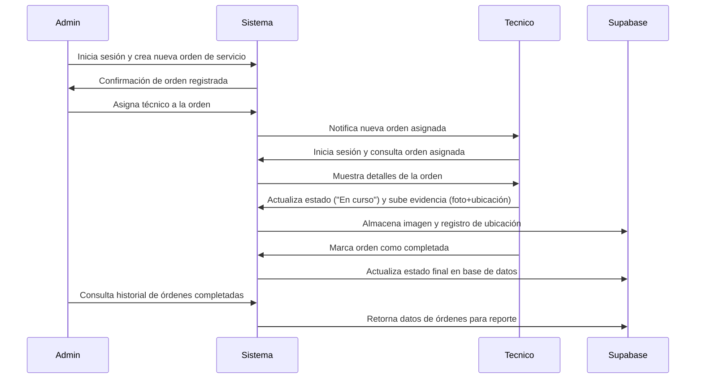
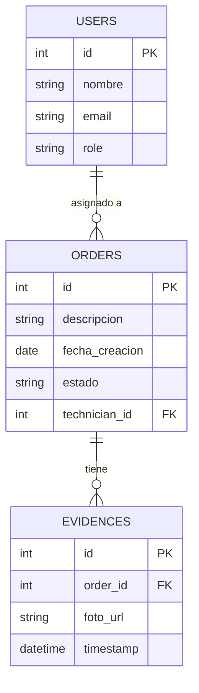
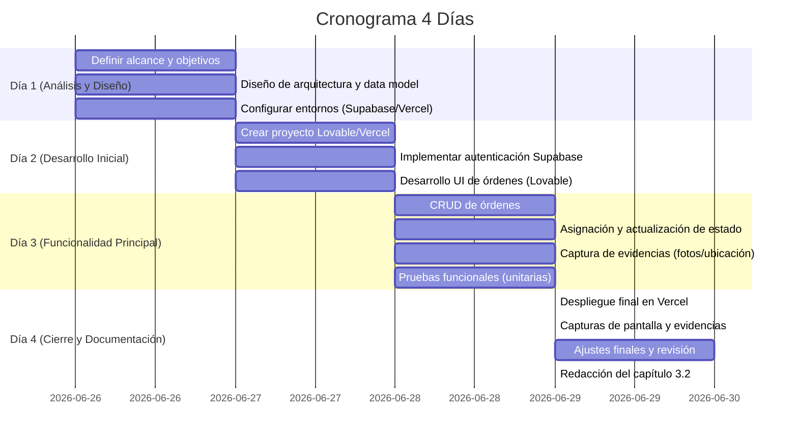

# Documento de Requisitos del Producto (PRD) – Control de Órdenes de Servicio

## Resumen Ejecutivo  
Este PRD define el sistema web PWA propuesto para gestionar órdenes de servicio en una entidad universitaria, integrando registro de tareas, asignación de técnicos y captura de evidencias fotográficas con geolocalización. El objetivo es automatizar y centralizar el proceso, mejorando la eficiencia operativa y reduciendo la pérdida de información. El proyecto empleará herramientas gratuitas (Supabase en backend, Vercel en hosting, Lovable/Gemini para desarrollo asistido, etc.), siguiendo la metodología de estadías. A lo largo del documento se detallan objetivos, alcance, actores, casos de uso, requerimientos (funcionales y no funcionales), arquitectura, modelo de datos, plan de 4 días, herramientas recomendadas y estrategia de documentación para el capítulo 3.2. La información se basa en la *Metodología para Reporte Final de Estadías* y los *Criterios de apoyo*, complementada con documentación oficial y fuentes técnicas (see fuentes al final). En este PRD se asume público objetivo universitario, despliegue en Vercel, backend en Supabase y frontend PWA, salvo indicación contraria (“no especificado”). 

## 1. Objetivo del producto  
Implementar un sistema web tipo PWA para **gestionar órdenes de servicio** (registro, programación y seguimiento) y sus evidencias (fotos con geolocalización), con autenticación de usuarios diferenciada por roles. Se busca optimizar la eficiencia del equipo técnico al centralizar la información, facilitar la asignación de tareas y asegurar la trazabilidad de cada servicio. El objetivo se formula siguiendo la estructura sugerida por la metodología: verbo en infinitivo + qué se hace + cómo/para qué. Por ejemplo: *“Implementar un sistema web PWA para el control integral de órdenes de servicio (registro, asignación de técnicos, actualización de estado) e incorporación de evidencias fotográficas con geolocalización, con el fin de mejorar la eficiencia operativa y evitar la pérdida de datos.”*.  

## 2. Alcance  
- **Incluye:** interfaz web PWA (accesible en navegadores modernos), gestión de usuarios (Roles: administrador/operador y técnico), registro de órdenes de servicio con campos (descripción, fecha, cliente, etc.), asignación de técnicos a órdenes, actualización de estado (en curso/completada), captura y almacenamiento de evidencias (imágenes GPS), consulta de historial de servicios, autenticación segura y despliegue gratuito.  
- **Queda fuera:** facturación o pagos, inventario de repuestos, módulos nativos móviles (solo web), funcionalidades no esenciales (notificaciones avanzadas, reportes complejos fuera de historia de órdenes). También no se desarrollan integraciones con sistemas externos ajenos (como sistemas contables).  

## 3. Actores y Permisos  
- **Administrador/Operador:** responsable institucional que puede crear, editar y eliminar órdenes; asignar técnicos; gestionar usuarios; ver todos los informes. Permisos: CRUD de órdenes y usuarios, ver evidencias.  
- **Técnico:** usuario operativo en campo. Permisos: ver solo sus órdenes asignadas, actualizar su estado (p.ej., “En curso”, “Completada”), subir evidencias fotográficas con ubicación, consultar datos del cliente asociado. No puede crear órdenes ni gestionar otros usuarios.  
- **(Opcional) Supervisor:** similar a administrador pero con vista de solo lectura adicional o reportes agregados (no especificado en fuentes).  
- **Usuario autenticado:** cualquier rol debe iniciar sesión para acceder; acceso restringido según rol. **Nota:** Se emplearán políticas RLS en Supabase para garantizar que cada técnico solo acceda a sus datos.  

## 4. Casos de Uso y Flujos Principales  

| ID  | Caso de Uso                     | Actor         | Descripción breve                                                  |
|-----|---------------------------------|---------------|--------------------------------------------------------------------|
| UC1 | Autenticación                   | Todos         | Iniciar/cerrar sesión según credenciales (email/contraseña o Google) para acceder al sistema. |
| UC2 | Registrar Orden de Servicio     | Administrador | Crear nueva orden: ingresar datos (cliente, descripción, fecha, etc.) en el sistema.         |
| UC3 | Asignar Técnico a Orden         | Administrador | Seleccionar un técnico disponible y asignarlo a una orden existente.                         |
| UC4 | Consultar Órdenes               | Administrador/Operador/Téc.| Ver lista de órdenes (todos o propias) y sus detalles.                                   |
| UC5 | Actualizar Estado de Orden      | Técnico       | Marcar orden como “En curso” o “Completada” durante el proceso de trabajo.                 |
| UC6 | Subir Evidencia (foto+ubicación)| Técnico       | Tomar y cargar foto como evidencia al completar tareas; el sistema registra la geolocalización. |
| UC7 | Consultar Historial de Servicios| Administrador | Visualizar órdenes anteriores, con filtros por fechas, técnicos o clientes.                 |
| UC8 | Gestionar Usuarios              | Administrador | (Opcional) Agregar/editar/eliminar cuentas de usuarios del sistema.                         |



Este diagrama secuencial ilustra el flujo clave: un administrador crea y asigna una orden, el técnico la atiende subiendo evidencias, y finalmente se consulta el historial desde el sistema. Cada paso generará evidencias (mensajes de confirmación, capturas de pantalla o registros) para documentar la implementación.

## 5. Requerimientos Funcionales  

| ID   | Requerimiento Funcional                                                        | Prioridad | Criterios de Aceptación                                                                                                         | Evidencia (3.2)                                       |
|------|--------------------------------------------------------------------------------|-----------|-------------------------------------------------------------------------------------------------------------------------------|-------------------------------------------------------|
| RF1  | **Autenticación de usuarios:** Inicio de sesión seguro con email/clave (o Google).   | Alta      | El sistema permite crear cuentas e iniciar sesión correctamente. Usuarios no autorizados no acceden.                             | Captura pantalla de login activo; registros en Supabase Auth.  |
| RF2  | **Gestión de órdenes de servicio:** CRUD de órdenes (crear, ver, editar, eliminar).             | Alta      | Al crear una orden, queda registrada en BD con estado inicial. Se muestran correctamente en lista.                             | Formulario de nueva orden (screenshot); tabla `orders` en Supabase. |
| RF3  | **Asignación de técnicos:** Vincular orden a usuario técnico específico.                        | Alta      | El administrador puede seleccionar técnico y asignar orden; el técnico asignado ve la orden en su lista.                        | Interfaz de asignación (screenshot); campo `technician_id` en BD. |
| RF4  | **Actualización de estado:** Técnico puede cambiar estado a “En curso”/“Completada”.             | Alta      | El técnico accede a su orden, actualiza estado; el cambio se refleja en BD y UI para todos (e.g. “Completada”).               | Captura del cambio de estado; consulta del campo `status` en BD. |
| RF5  | **Captura de evidencias:** Subir fotos con posición geográfica asociada a la orden.             | Alta      | El técnico puede tomar/cargar foto; la imagen se guarda en Storage y la URL en BD junto a latitud/longitud.                    | Página de subida de imágenes (screenshot); registro en tabla `evidences`. |
| RF6  | **Consultas y filtros:** Ver lista de órdenes con filtros básicos (por fecha, técnico, estado).  | Media     | El sistema muestra búsquedas filtradas (p.ej. sólo “Completadas” o por técnico X).                                            | Ejemplo de lista filtrada (captura); parámetros de búsqueda ejecutados. |
| RF7  | **Gestión de usuarios:** (Si aplica) Crear/editar/eliminar usuarios y asignar roles.           | Media     | Administrador puede gestionar cuentas de técnicos y operadores.                                                             | IU de administración de usuarios (screenshot); tabla `users` con roles. |
| RF8  | **Interfaz PWA:** El frontend funciona en navegadores modernos y móvil, y se puede “instalar” como app. | Media     | La app se comporta como PWA: ofrece opción “Agregar a pantalla de inicio” y funciona offline parcial.                        | Captura de la opción de instalación; manifest.json configurado. |
| RF9  | **Datos offline:** Soporte limitado offline: ver últimas órdenes cargadas (p.ej. usando Service Worker). | Baja      | La aplicación carga datos almacenados si no hay conexión.                                                                    | Demo de modo offline (captura de consola de Service Worker). |

## 6. Requerimientos No Funcionales  

- **Seguridad:** Autenticación de usuarios y control de acceso. Se empleará RLS en Supabase para que cada usuario solo acceda a sus datos. Toda comunicación será HTTPS. Validación de inputs tanto en frontend como en backend para evitar inyecciones.  
- **Rendimiento:** Páginas ligeras, tiempos de carga breves (<2s en conexiones básicas). Uso de CDN (Vercel CDN por defecto) para assets y optimización de imágenes. Supervisar latencia de base de datos.  
- **Escalabilidad:** La arquitectura serverless y de base de datos SQL permite crecer (mientras el tráfico sea moderado, la opción gratuita de Supabase cubre varios miles de filas). En caso de más demanda, se podrá migrar a planes pagos.  
- **Compatibilidad:** Funciona en Chrome, Edge, Firefox y Safari recientes. Soporta tanto escritorio como móvil, adaptando la UI. Debe cumplir estándares web (HTML5, CSS3).  
- **Accesibilidad:** Diseño responsivo; uso de etiquetas ARIA y contraste adecuado. El contenido básico (formularios, tablas) debe ser legible para lectores de pantalla. Se revisará al menos nivel AA de WCAG.  
- **PWA y offline:** Como PWA, la app debe ser **instalable** y funcionar fuera de línea hasta donde sea posible. Según buenas prácticas de PWAs, debe cargar contenidos esenciales sin conexión. Se implementará Service Worker para cachear recursos estáticos y datos recientes. En caso de funciones avanzadas no disponibles offline, se proveerá experiencia degradada (mensaje de error amable).  
- **Disponibilidad:** El sistema será accesible 24/7 con tiempo de actividad alto (usar Vercel/Hobby). Se planearán backups periódicos de la BD (función interna de Supabase) y monitoreo básico (p.ej. Google Analytics para caídas).  

## 7. Arquitectura Propuesta  
Se propone una arquitectura de front-back separados, basada en tecnologías gratuitas:

```mermaid
flowchart LR
  subgraph Usuario
    U1(Universitario (usuario))
  end
  subgraph Navegador
    A(Web App PWA)
  end
  subgraph Hosting
    Vercel[Vercel Hosting]
  end
  subgraph Backend
    Supabase[Supabase (Auth, DB Postgres, Storage, Edge)]
  end
  subgraph Desarrollo
    DevTools(Lovable / VSCode / Gemini CLI)
    GitHub(GitHub Repo)
  end

  U1 --> A
  A --> Vercel
  Vercel --> A
  A --> Supabase
  DevTools --> GitHub
  GitHub --> Vercel
```

**Justificación de stack gratuito:** Para el backend se elige **Supabase** (base de datos PostgreSQL, autenticación y almacenamiento) porque es open-source y ofrece tier gratuito suficiente para prototipos. El frontend será una PWA desplegada en **Vercel** (plan Hobby gratuito), lo cual facilita CI/CD automático desde un repo en **GitHub**. Para acelerar el desarrollo visual sin código, se usará **Lovable** (agente IA que genera UI y queries SQL). El asistente de programación será **Gemini CLI** (AI CLI de Google, gratis con cuenta personal). Las herramientas de diseño y documentación incluyen **Excalidraw** (whiteboard gratuito) y **Mermaid** (diagramas de texto open-source). En conjunto, este stack cumple requisitos gratuitos, escalables y fáciles de usar. 

## 8. Modelo de Datos Inicial  



**Explicación:**  
- **USERS:** Tabla de usuarios (técnicos, administradores). Campos clave: `id`, `nombre`, `email`, `role` (administrador/técnico). Se usará el sistema de Auth de Supabase que sincroniza con esta tabla (Roles controlan permisos).  
- **ORDERS:** Tabla de órdenes de servicio. Incluye `id`, `descripción`, fecha de creación, `estado` (e.g. “Pendiente”, “En curso”, “Completada”) y `technician_id` (clave foránea a USERS). Permite saber qué técnico está asignado.  
- **EVIDENCES:** Tabla de evidencias para cada orden. Campos: `id`, `order_id` (FK a ORDERS), `foto_url` (ruta en Supabase Storage) y `timestamp` (fecha/hora de carga). Una orden puede tener múltiples fotos.  
- **Relaciones:** Un usuario (técnico) puede tener muchas órdenes asignadas; cada orden puede tener varias evidencias. Esta estructura inicial provee la base para las funcionalidades clave (registrar y consultar órdenes con sus evidencias).  

## 9. Plan Mínimo Viable (4 días)  

Se detallan tareas diarias, entregables y riesgos principales:



- **Entregables diarios:** Al final de cada día se debe entregar: diagrama de arquitectura (Día1), prototipo básico de UI con login (Día2), módulo de órdenes funcional con evidencias (Día3), despliegue activo + documentación inicial (Día4).  
- **Riesgos y mitigaciones:**  
  - *Dependencia IA:* Las herramientas IA (Lovable/Gemini) pueden generar código inesperado. **Mitigación:** verificar manualmente el código generado, tener conocimientos básicos para corregir fallos.  
  - *Límites de cuota:* Los servicios (Supabase, Vercel) tienen límites gratuitos. **Mitigación:** usar el modo hobby con monitoreo; optimizar uso de la BD; usar *Preview* y caches para no exceder APIs.  
  - *Plazo corto:* Solo 4 días; puede haber imprevistos. **Mitigación:** priorizar características críticas (MVP), dejar extras para después y documentar cualquier pendiente.  
  - *Conectividad:* Si falta Internet, el desarrollo se detiene. **Mitigación:** plan alterno (desarrollo local con ex. Docker, VSCode) y pre-carga de recursos.  
  - *Seguridad:* Descuido en reglas RLS puede exponer datos. **Mitigación:** configurar RLS desde el inicio y probar con usuarios de prueba para asegurar aislamiento de datos.

## 10. Herramientas IA y NoCode/VibeCoding (gratuitas)  
Para cada tarea clave se recomienda el siguiente combo de herramientas gratuitas (enlaces incluidos):

- **Diseño y desarrollo UI:** **Lovable** – plataforma AI No-Code que genera interfaces web por chat. Permite describir pantallas en lenguaje natural y genera el código React/Next.js automáticamente. Integrado con Supabase.  
- **Backend y autenticación:** **Supabase** – plataforma open-source similar a Firebase, con Postgres, Auth y Storage. Ofrece tier gratuito (sin tarjeta), genera APIs instantáneas y almacenamiento de fotos.  
- **IDE Cloud:** **Firebase Studio** (Google) – entorno de desarrollo web basado en la nube con IA (versión preview gratuita). Útil para prototipar y desplegar rápido apps full-stack. *Nota:* es experimento preview (se descontinúa en 2027), por lo que se recomienda exportar el código a GitHub si se sigue usando.  
- **Asistente de código:** **Gemini CLI** – cliente open-source de Google Gemini AI. Con un *account* Google personal brinda acceso gratuito a Gemini 2.5 Pro (gran contexto de 1M tokens). Ideal para generar ejemplos de código, depurar errores o escribir consultas SQL por voz.  
- **Control de versiones:** **GitHub** – repositorios gratuitos, integración CI/CD (en Vercel se conecta con GitHub). Disponible para equipos académicos (GitHub Education).  
- **Hosting:** **Vercel** – hosting estático/Serverless con plan Hobby gratuito. Despliegue automático desde GitHub, CDN global y HTTPS por defecto.  
- **Editor de código:** **VSCode** – editor gratuito con extensiones de IA (GitHub Copilot gratuito para estudiantes, IntelliCode). Sirve para ajustes finos al código generado.  
- **Diagrama y prototipado:** **Excalidraw** – pizarra digital open-source, “dibujos a mano” para diagramas técnicos. Permite crear wireframes y diagramas rápidos sin instalar nada.  
- **Diagramas de texto:** **Mermaid** – librería JS open-source para diagramas (flowcharts, secuencias, Gantt) mediante texto. Integrable en Markdown/GitHub para flujos y cronogramas.  
- **Base de datos alternativa:** **Firebase (Firestore)** – aunque usamos Supabase, Firestore podría usarse con Firebase Studio (tiene tier gratuito amplio) si se prefiere. **Nota:** Firebase es adecuado para MVP pero menos SQL.  
- **Chat de soporte/StackOverflow:** Comunidades (Stack Overflow, Reddit) para resolver dudas de integración.  

Cada herramienta elegida tiene nivel gratuito suficiente y documentación accesible. Por ejemplo, Lovable junto con Supabase facilita que usuarios no desarrolladores construyan apps completas, mientras que Gemini CLI ofrece soporte de IA avanzado gratis. 

## 11. Estrategia de Documentación y Evidencias (Capítulo 3.2)  
Para documentar la implementación en el capítulo 3.2 del informe final, se recomienda **capturar y anotar** lo siguiente en cada etapa clave:

- **Diagrama de Arquitectura:** Incluir el diagrama del stack (como el anterior) o equivalente en Excalidraw/Mermaid.  
- **Interfaz de usuario:** Capturas de pantalla de pantallas principales: login, formulario de orden, lista de órdenes, pantalla de carga de evidencia. Anotar roles en cada captura.  
- **Flujos de uso:** Incluir el diagrama secuencial de caso de uso (como el mermaid arriba) o diagramas de flujo en Excalidraw.  
- **Código clave:** Fragmentos relevantes generados por Lovable o Gemini (por ejemplo, la estructura SQL creada o lógica de funciones). Resaltar modificaciones manuales si las hubo.  
- **Base de datos y RLS:** Captura del panel de Supabase mostrando las tablas `users`, `orders`, `evidences` y las políticas RLS habilitadas.  
- **Pruebas y registros:** Logs de prueba o resultados de Postman que demuestren que las APIs funcionan (creación de orden, autenticación). Pantallas de la consola de Vercel/Supabase con registros de despliegue exitoso.  
- **Evidencias adicionales:** Breves videos demo (opcional) mostrando el flujo de trabajo completo. Archivos de configuración (e.g. `manifest.json` de PWA, `vercel.json`).  
- **Explicación escrita:** Para cada captura/diagrama, describir qué se muestra y cómo verifica un requisito del PRD. Por ejemplo: “Figura X: Interfaz de registro de orden. El administrador ingresa detalles y el sistema guarda la orden (ver RF2)”.  
- **Referencias en la metodología:** Vincular cada resultado con los criterios de apoyo de la metodología (p.ej. justificación de las decisiones).  

Esta estrategia asegurará que el capítulo 3.2 sirva como evidencia completa: cada requerimiento funcional se demuestra con capturas y diagramas, siguiendo la guía de los criterios de apoyo. Se recomienda usar herramientas de captura de pantalla (p.ej. OBS o la función nativa), y almacenar las evidencias (imágenes, archivos) como respaldo. 

## Fuentes Principales Consultadas  
- Atlassian *“¿Qué es un documento de requisitos de producto (PRD)?”* (agile.product-management).  
- Scribd *Metodología para Reporte Final de Estadías* (guía académica), sección Objetivos y Estructura.  
- Lovable Docs – Integración con Supabase.  
- Google Firebase (studio.firebase.google.com) – descripción de Firebase Studio en español.  
- Reddit *r/Firebase*: hilo sobre Firebase Studio (comentarios de usuarios).  
- Google Blog “Gemini CLI: your open-source AI agent”.  
- Supabase Docs – Seguridad y Row Level Security.  
- Vercel Pricing (Hobby plan gratuito).  
- Excalidraw – página oficial (“Free & Open source”).  
- Mermaid – sitio oficial (“Easy to use... Live Editor”).  
- web.dev (Google) – Guía PWAs, offline y compatibilidad.  

Estas fuentes proporcionan soporte técnico y ejemplos directos sobre las herramientas gratuitas y buenas prácticas mencionadas, complementando los lineamientos metodológicos provistos. Cada una se ha citado en el texto donde corresponde.